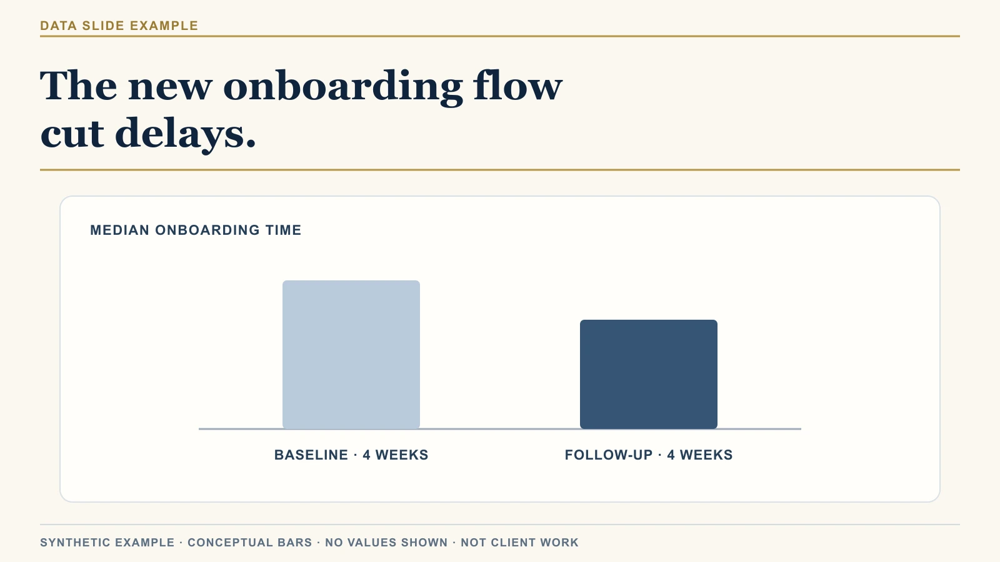
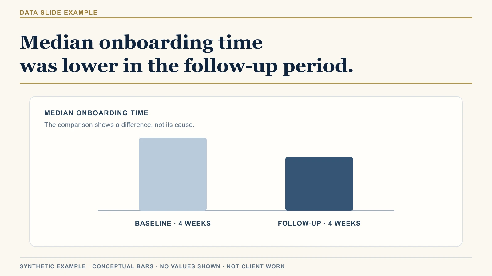

# An Accurate Chart Can Still Overstate Its Case

A chart can be accurate and still support a weaker conclusion than its headline suggests.

In an investor update or executive proposal, your audience reads the headline before the chart details. If the title makes a bigger claim than the measure supports, they have to supply the missing logic.

## A synthetic example

*The title claims cause while the chart shows a difference across two periods.*

A team tests a new onboarding flow. The slide compares median onboarding time across the four weeks before launch and the four weeks after. The later period has a lower median.

The headline says:

> The new onboarding flow cut delays.

This is a synthetic example, not client material. The bars show a directional difference and no real values.

The slide title credits the new flow for the lower median. A simple two-period comparison does not show whether the flow caused the difference or another change did. The U.S. Government Accountability Office explains this limit in its [guide to designing evaluations](https://www.gao.gov/products/gao-12-208g).

A colleague might ask, “What else changed during those weeks?” The two bars offer no evidence about other changes. A staffing shift or a different customer mix could also lower the median.

Use the chart to report the lower median. Add a causal claim only when your comparison can support one.

## Check the headline before polishing the chart

Test the headline with three checks.

### 1. Find the claim in the verb

“Caused,” “reduced,” “improved,” and “drove” say why the measure changed.

“The new flow cut onboarding time” says the flow caused a change.

“Onboarding time was lower after the new flow launched” reports timing and an observed difference.

The second title reports what the bars show; “cut” claims the flow caused it.

### 2. Name the measure

“Delays” can mean days from contract signature to setup or time spent waiting for customer information. If your chart measures median onboarding time, name that measure in the title.

Keep its start and end points consistent across periods. A window from contract signature to setup completion measures something different from a window that starts when customers submit documents.

If the median includes only completed onboardings, state that. Accounts still in progress do not appear in the calculation.

### 3. Name the comparison

Name the two windows and the customer group in each. Keep the metric definition and collection method consistent. If the pilot included a different customer mix from the earlier period, say so in a note. That difference can shift the median.

Keep the windows the same length, or explain why they differ. Put their date ranges in a note if the chart cannot show them clearly.

## Separate the observation from the explanation

Write three lines before choosing the title:

- **Observation:** What changed in the data?
- **Explanation:** What might account for that change?
- **Implication:** What should the audience do with it?

For the synthetic onboarding example:

- **Observation:** Median onboarding time was lower during the four weeks after launch.
- **Explanation:** The comparison cannot isolate the flow's effect from other changes in that period.
- **Implication:** The team can examine the pilot; this comparison alone does not establish that the flow caused the difference.

Use the observation as the title. Put the explanation in a note and the implication in your recommendation or next step.

A decision may still be due while evidence is limited. Tell the audience what the team plans to check next, such as whether the same result appears in the next customer cohort.

Use this check with preliminary data or a decision due soon. Add a note that names the limit: “Median onboarding time was lower during the follow-up period, but this comparison does not isolate the flow's effect.” Keep it beside the chart so the audience can weigh the result.

## The useful first fix

*The revised title states the observation and leaves its cause open.*

Put the headline beside the measure and comparison. Check that all three support the same statement before you adjust colors, labels, or chart type.

Settle the headline once it fits the evidence, then polish the chart.

On Friday, I’ll test this on another synthetic slide and show the questions I’d raise before an executive presentation.

